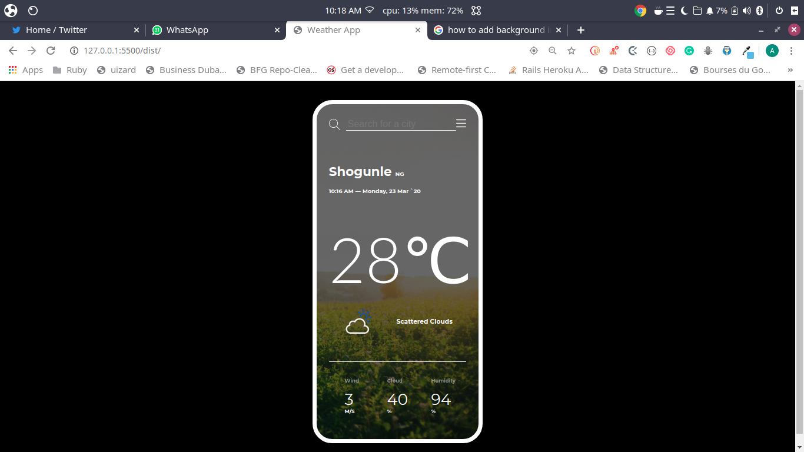

<!-- PROJECT SHIELDS -->
<!--
*** I'm using markdown "reference style" links for readability.
*** Reference links are enclosed in brackets [ ] instead of parentheses ( ).
*** See the bottom of this document for the declaration of the reference variables
*** for contributors-url, forks-url, etc. This is an optional, concise syntax you may use.
*** https://www.markdownguide.org/basic-syntax/#reference-style-links
-->
[![Contributors][contributors-shield]][contributors-url]
[![Forks][forks-shield]][forks-url]
[![Stargazers][stars-shield]][stars-url]
[![Issues][issues-shield]][issues-url]
[![MIT License][license-shield]][license-url]


<!-- PROJECT LOGO -->
<br />
<p align="center">
  <h3 align="center">Weather App</h3>
  <p align="center">
   This is a light weight weather app to test the knowledge of asynchronous functions and consuming external API's in our app using Javascript.
    <br />
    <a href="https://github.com/abruzy/weather-app/blob/master/README.md"><strong>Explore the docs �</strong></a>
    <br />
    <br />
    <a href="https://www.theodinproject.com/courses/ruby-programming/lessons/advanced-building-blocks.">Assigment</a>
    �
    <a href="https://github.com/abruzy/weather-app/issues">Report Bug</a>
    �
    <a href="https://github.com/abruzy/weather-app/issues">Request Feature</a>
  </p>
</p>


<!-- TABLE OF CONTENTS -->
## Table of Contents

* [About the Project](#about-the-project)
  * [Built With](#built-with)
* [Getting Started](#getting-started)
  * [Prerequisites](#prerequisites)
  * [Installation](#installation)
* [Usage](#usage)
* [Roadmap](#roadmap)
* [Contributing](#contributing)
* [License](#license)
* [Contact](#contact)
* [Acknowledgements](#acknowledgements)


<!-- ABOUT THE PROJECT -->
## About The Project


<!-- [![Product Name Screen Shot][product-screenshot]](https://example.com) -->

Weather app created using vanilla JS, connects to Open-weather and Ipfind APIs, and dynamically renders weather data -in Metric and Imperial units- for clients city or other cities chosen with the search form. The search form uses a modified list from OpenWeather to suggest and validate the user's input.

### Built With
This progam was made using this technologies
* [Javascript](https://developer.mozilla.org/en-US/docs/Web/JavaScript)


<!-- GETTING STARTED -->
## Getting Started

To get a local copy up and running follow these simple example steps.

### Installation

<!-- 1. Get a free API Key at [https://example.com](https://example.com) -->
1. Clone the repo
```sh
git clone https://github.com/abruzy/weather-app
cd weather-app
npm install
npm run build
```

<!-- USAGE EXAMPLES -->
## Usage
```
open live-server
```
 | Visit http://127.0.0.1:5500/dist/

<!-- ROADMAP -->
## Roadmap

See the [open issues](https://github.com/abruzy/weather-app/issues) for a list of proposed features (and known issues).


<!-- CONTRIBUTING -->
## Contributing

Contributions are what make the open source community such an amazing place to be learn, inspire, and create. Any contributions you make are **greatly appreciated**.

1. Fork the Project
2. Create your Feature Branch (`git checkout -b feature/AmazingFeature`)
3. Commit your Changes (`git commit -m 'Add some AmazingFeature'`)
4. Push to the Branch (`git push origin feature/AmazingFeature`)
5. Open a Pull Request


<!-- LICENSE -->
## License

Distributed under the MIT License. See `LICENSE` for more information.


<!-- CONTACT -->
## Contact

* Abubarkar Diallo: [Github](https://github.com/abruzy)

Project Link: [https://github.com/abruzy/weather-app](https://github.com/abruzy/weather-app)

<!-- ACKNOWLEDGEMENTS -->
## Acknowledgements
* [Microverse](https://www.microverse.org/)
* [The Odin Project](https://www.theodinproject.com/)


<!-- MARKDOWN LINKS & IMAGES -->
<!-- https://www.markdownguide.org/basic-syntax/#reference-style-links -->
[contributors-shield]: https://img.shields.io/github/contributors/abruzy/bookstore
[contributors-url]: https://github.com/abruzy/weather-app/graphs/contributors
[forks-shield]: https://img.shields.io/github/forks/abruzy/bookstore
[forks-url]: https://github.com/abruzy/weather-app/network/members
[stars-shield]: https://img.shields.io/github/stars/abruzy/bookstore
[stars-url]: https://github.com/abruzy/weather-app/stargazers
[issues-shield]: https://img.shields.io/github/issues/abruzy/bookstore
[issues-url]: https://github.com/abruzy/weather-app/issues
[license-shield]: https://img.shields.io/github/license/abruzy/bookstore
[license-url]: https://github.com/abruzy/weather-app/blob/master/LICENSE.txt

